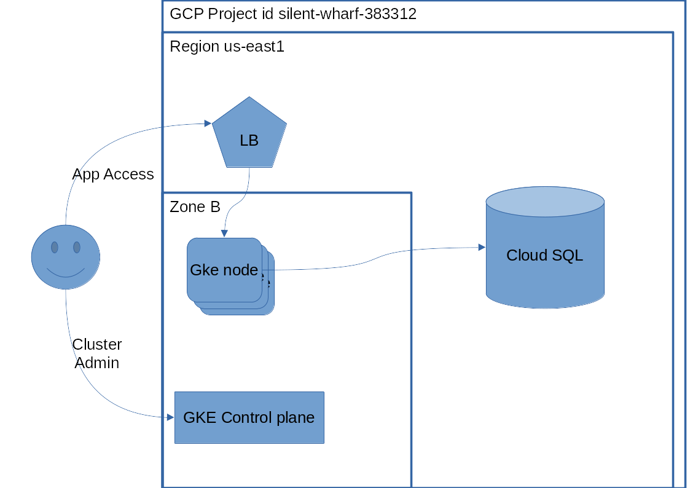
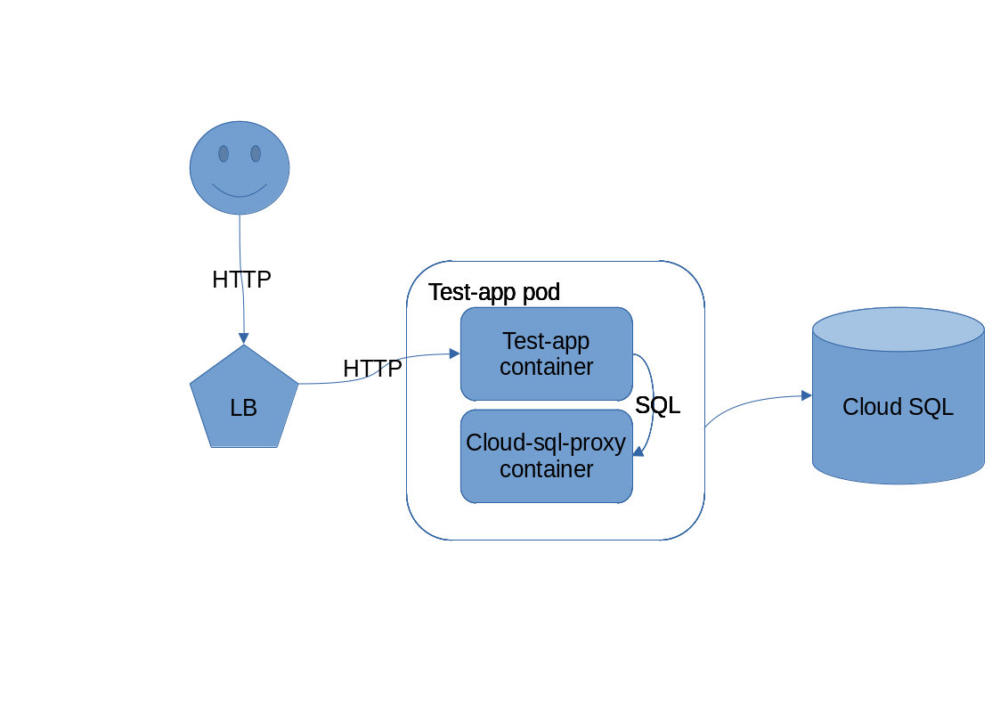

#  FACEIT DevOps Challenge solution

This solution leverages GCP for the ifrastructure.

It uses:
- GKE (with one node pool)
- Cloud SQL
- Docker hub (for hosting the application image)

The application is packaged onto a docker container published on docker-hub.

# Infrastructure

GCP was chosen due to the features available on the free tier, the long free trial period and the fact that there would not be a danger of runaway costs.

The cluster and DB instance are deployed onto the "My First Project" default project, on zone B of the us-east1 region. All of these can easily be change on kubernetes/terraform.tfvars .

The following diagram gives a general view of the GCP architecture


## Kubernetes Cluster

A GKE cluster is deployed by terraform.

The cluster is deployed with the control plane and a separate node pool, to the B zone of the region.

By default, the node pool has a single node, but this can easily be changed on kubernetes/terraform.tfvars .

For simplicity, address management is automatic, i.e. no explicit definition of a VPC and network ranges. For a production work load there would be a need to have a more thorough network architecture.

The terraform code also configures a service account and places it as a secret to be used by the cloud-sql-proxy sidecar used by the application to connect to the DB server.

A service account is configured to allow the cloud-sql-proxy to connect to the SQL instance, and a secret is automatically created.

For this, Cloudsql admin api must be enabled.


Terraform manifest for the SQL server is under `kubernetes/kubernetes.tf`

## SQL server

A Cloud SQL instance is deployed by terraform.
This istance is deployed with public addresses only, as using private addresses would need to define VPCs and networks, which would need a more complext terraform manifest.

For the application to access this instance, Cloudsql admin api must be enabled.

Terraform manifest for the SQL server is under `kubernetes/db.tf`

## Application deployment

The application is deployed as a kubernetes deployment.

The application is accessed via a service with an external load balancer.

Secrets are configured to allow the application to authenticate against the Database, and to allow the cloud-sql-proxy access to the SQL instance.

The application is deployed onto pods with two containers:
- the test-app using the dnalencastre/fi-ops-test-app docker image
- the cloud-sql-proxy sidecar

The cloud-sql-proxy sidecar is used to enable connectivity between the test-app container and the SQL instance, as recommended by Google.
This also simplifies the infrastructure architecture as it allows the SQL instance to be deployed with public addresses (deploying it with private addesses needs a more complex terraform manifest). For a production work load there would be a need to have a more thorough network architecture.

The following diagram explains the data flows for client access and application access to the database.



## Application packaging

The application is packaged onto a docker container, using a multi-stage approach to minimize size.

The resulting docker container is pushed to docker hub to dnalencastre/fi-ops-test-app

```
docker tag fi-ops-test-app:1.0.0 dnalencastre/fi-ops-test-app:1.0.0
docker push dnalencastre/fi-ops-test-app:1.0.0
```


# Deployment

## infrastructure

Determine the region, zone (for the cluster) and project to be used, update terraform.tfvars accordingly.

Review the remaining values present on terraform.tfvars.

Authenticate with GCP
```
gcloud auth application-default login
```

Enter the `terraform` subdirectory 

Initialize terraform modules and state
```
terraform init
```

Review and Deploy the infrastructure 
```
terraform apply
```

Once finished, terraform will report on the `Connection Name` for the db instance. This will configured on the cloud-sql-proxy pod on the kubernetes deployment manifest.

Once deployed, add the kubernetes cluster's authentication details to your kube config with:
```
gcloud container clusters get-credentials duarte-test-gke-01 \
    --region us-east1-b
```
Replace `duarte-test-gke-01` and the region with the values used for your deployment.

## Application deployment

The application deployment is specified on `kubernetes/deployment.yaml`

For simplicity , the default namespace is used.

Edit ``kubernetes/deployment.yaml` and the cloud-sql-proxy "Connection Name" to the value provided by the `db_connection_name` output from the terraform deployment step.

apply with:
```
kubectl apply -f kubernetes/deployment.yaml
```

Obtain the ip address of the load balancer serving the deployment with 
```
kubectl get service/test-app-service -o jsonpath='{.status.loadBalancer.ingress[*].ip}'
```
