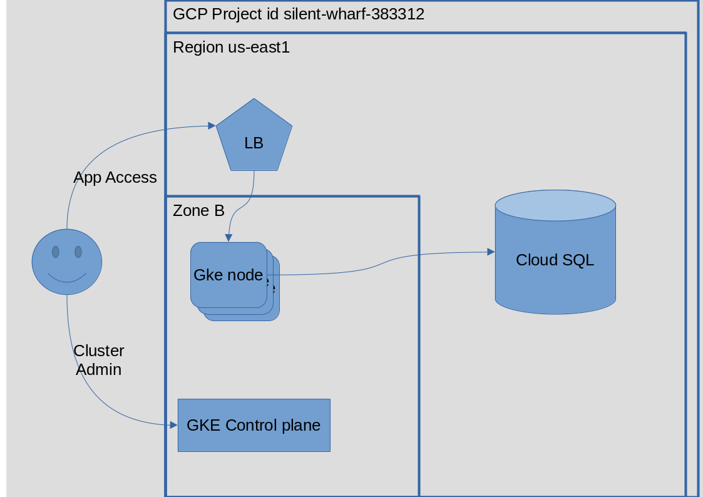

#  FACEIT DevOps Challenge solution

This solution leverages GCP for the ifrastructure.

It uses:
- GKE (with one node pool)
- Cloud SQL
- Docker hub (for hosting the application image)

The application is packaged onto a docker container published on docker-hub.

# Infrastructure

GCP was chosen due to the features available on the free tier, the long free trial period and the fact that there would not be a danger of runaway costs.

The cluster and DB instance are deployed onto the "My First Project" default project, on zone B of the us-east1 region. All of these can easily be change on kubernetes/terraform.tfvars .

The following diagram gives a general view of the GCP architecture


The current deployment implementation is lacking in facilities for public access.
The following would be needed:
- A dns name (and domain) to allow for easy access
- Using TLS encrypted connections to access the API
- Replace the basic external loadbalancer kubernetes `service` with an ingress or a mesh service to deal with routing the traffic to the individual pods.

## Kubernetes Cluster

A GKE cluster is deployed by terraform.

The cluster is deployed with the control plane and a separate node pool, to the B zone of the region.

By default, the node pool has a single node, but this can easily be changed on kubernetes/terraform.tfvars .

For simplicity, address management is automatic, i.e. no explicit definition of a VPC and network ranges. For a production work load there would be a need to have a more thorough network architecture.

The terraform code also configures a service account and places it as a secret to be used by the cloud-sql-proxy sidecar used by the application to connect to the DB server.

A service account is configured to allow the cloud-sql-proxy to connect to the SQL instance, and a secret is automatically created.

For this, Cloudsql admin api must be enabled.


Terraform manifest for the SQL server is under `kubernetes/kubernetes.tf`

## SQL server

A Cloud SQL instance is deployed by terraform.
This istance is deployed with public addresses only, as using private addresses would need to define VPCs and networks, which would need a more complext terraform manifest.

For the application to access this instance, Cloudsql admin api must be enabled.

Terraform manifest for the SQL server is under `kubernetes/db.tf`

## Application deployment

The application is deployed as a kubernetes deployment.

The application is accessed via a service with an external load balancer.

Secrets are configured to allow the application to authenticate against the Database, and to allow the cloud-sql-proxy access to the SQL instance.

The application is deployed onto pods with two containers:
- the test-app using the dnalencastre/fi-ops-test-app docker image
- the cloud-sql-proxy sidecar

The cloud-sql-proxy sidecar is used to enable connectivity between the test-app container and the SQL instance, as recommended by Google.
This also simplifies the infrastructure architecture as it allows the SQL instance to be deployed with public addresses (deploying it with private addesses needs a more complex terraform manifest). For a production work load there would be a need to have a more thorough network architecture.

The following diagram explains the data flows for client access and application access to the database.


## Application packaging

The application is packaged onto a docker container, using a multi-stage approach to minimize size.

The resulting docker container is pushed to docker hub to dnalencastre/fi-ops-test-app

```
docker tag fi-ops-test-app:1.0.0 dnalencastre/fi-ops-test-app:1.0.0
docker push dnalencastre/fi-ops-test-app:1.0.0
```

## Security

Security should be further increased by:
- Split the service account in use by the cluster and by cloud-sql-proxy to access the SQL instance, to allow separation of privileges and more restrictive permission set.
- Using TLS termination on the Load balancer, to encrypt traffic from the clients to the application.
- Using a secret management system (such as vault, secret manager) to manage secrets, most importantly DB connection secrets
- Create a network architecture that allows the DB instance to not be exposed to the public internet
- Create a network architecture that allows segregation of the various components of the system.
- Keeping terraform state and locking on the web, to minimize state synchronization issues and conflicting simultaneous operations.

A network could be designed so as to enable:
- that the only exposed resources are the load balancers
- that only the kubernetes nodes are accessible by the load balancer
- that the DB instance is only reacheable by the nodes of the kuberntes cluster and by authorized developers/admin personell.
- enforcment of access controls to developers/admin personell to the relevant resources (e.g. by using vpns, acls and firewalling), reducing the exposure footprint of the system.
- Deployment of IDS/IDP systems, on hosts and on the network.

## scalability

The current implementation already allows for (static) scaling of:
- Nodes in the cluster
- Pods in the service

Pods can be scaled up by editing the number of replicas on `kubernetes/deployment.yaml` and reaplying.

Nodes can be scaled up by editing the `kubernetes_node_count` variable on the `terraform/terraform.tfvars` file and re-applying terraform.

### Automated scaling

Automated pod autoscaling can be achieved with the `HorizontalPodAutoscaler`. The decision regarding which metrics to use triggering the autoscalling would need further studie.

Automated node autoscaling could be achieved via GKE's autoscaler.


# Possible solution for Deployment via CI/CD

The current implementation relies on manual instantiation of terraform and kubectl.

Separate Pipelines/taks for deploying the infrastructure and the application.

### infrastructure
The infrastructure should have `man-in-the-loop` checks, to avoid completely automated destruction.

Terraform state should be kept on a cloud resource (e.g. blob storage), as well as state locking, to enable multiple concurrent/competing jobs and build processes. Another option would be hosted terraform.

If not using hosted terraform, the build hosts would need access to `kubectl` and the providers.

Deployment pipelines could be triggered by using specific tags on the code.

When major changes are to be applied, consider deploying completely new cluster, and use an external load balancer to switch traffic.

### Application

The current application deployment method is a good base for zero downtime deployments.

The kubernetes `deployment` resource, by default, allows for rolling deployments of new versions, allowing for no dowtime.
Alternatively, a `blue-green` deployment model could be considered, by leveraging the labelling mechanism.

The secret portion of the manifest should ideally be replaced by a proper secret management system (such as vault), or moved to it's own file, possibly with a separate deployment pipeline.

Instead of a `service` resource, an `ingress` resource should be used, ideally on a different file. This could also be deployed with a different pipeline, since changing url endpoints could be considered sensitive.

A system such as ArgoCD could also be leveraged for kuberntes native continuos delivery.

# Deployment

## infrastructure

Determine the region, zone (for the cluster) and project to be used, update terraform.tfvars accordingly.

Review the remaining values present on terraform.tfvars.

Authenticate with GCP
```
gcloud auth application-default login
```

Enter the `terraform` subdirectory 

Initialize terraform modules and state
```
terraform init
```

Review and Deploy the infrastructure 
```
terraform apply
```

Once finished, terraform will report on the `Connection Name` for the db instance. This will configured on the cloud-sql-proxy pod on the kubernetes deployment manifest.

Once deployed, add the kubernetes cluster's authentication details to your kube config with:
```
gcloud container clusters get-credentials duarte-test-gke-01 \
    --region us-east1-b
```
Replace `duarte-test-gke-01` and the region with the values used for your deployment.


## Application

The application deployment is specified on `kubernetes/deployment.yaml`

For simplicity , the default namespace is used.

Edit ``kubernetes/deployment.yaml` and the cloud-sql-proxy "Connection Name" to the value provided by the `db_connection_name` output from the terraform deployment step.

apply with:
```
kubectl apply -f kubernetes/deployment.yaml
```

Obtain the ip address of the load balancer serving the deployment with 
```
kubectl get service/test-app-service -o jsonpath='{.status.loadBalancer.ingress[*].ip}'
```
